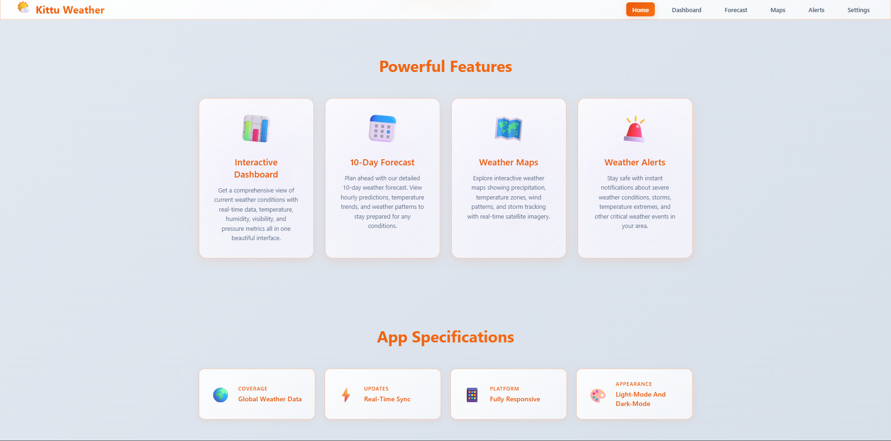

 Kittu Weather Companion

A Premium Weather Application built with JavaScript and Express.js, providing real-time weather updates, intelligent forecasts, dynamic maps, and weather alerts — all wrapped in a stunning interface with Dark & Light Mode support.

---

 Overview

Kittu Weather Companion is a feature-rich, responsive weather application designed to deliver global weather insights with accuracy and speed. It includes an interactive map that automatically zooms into the selected location, customizable weather icons, and a dedicated alert system to keep users informed of severe conditions.

---

 Key Features
 Dark Mode & Light Mode

Seamlessly toggle between themes for enhanced readability and comfort.

Automatic theme persistence using local storage or system preference detection.

---

 Interactive Dashboard

Real-time weather stats: Temperature, humidity, wind speed, visibility, and atmospheric pressure.

Clean UI powered by Express.js templates and JavaScript functionality.

---

 10-Day Weather Forecast

Detailed daily and hourly forecasts.

Custom SVG icons handcrafted for each weather condition (rain, thunder, snow, clear sky, etc.)

Intuitive weather trend visualization.

---

 Intelligent Weather Map

Interactive global weather map.

Automatically zooms to the selected region upon user input.

Shows precipitation layers, wind patterns, and satellite data in real-time.

---

 Weather Alerts Page

Dedicated alert module that displays real-time warnings such as storms, rainfall, or extreme temperatures.

Helps users stay informed and prepared for critical weather changes.

---

 Specifications

Specification	Details

 Coverage	Global Weather Data

 Sync Rate	Real-Time API Integration

 Backend	JavaScript (Node.js + Express)

 Themes	Fully Responsive + Dark/Light Modes

 Map Feature	Auto-Zoom to Selected Location

 Custom UI	Weather-specific SVG Icons

---

 Tech Stack

Backend: Node.js + Express.js

Frontend: HTML, CSS, JavaScript.

Weather API: OpenWeather API.

Map Integration: Leaflet

Styling: Custom CSS

---

 Installation
 # Clone the repository
git clone https://github.com/sanjayzorojuro/Kittu-weather.git

Navigate to project directory
# cd Kittu-weather

# Install dependencies
npm install

# Start the Express server
node server.js

---

 Core Modules

🔹 Dashboard

Displays current weather conditions with real-time syncing and hourly forecast.

🔹 Forecast Page

10-day forecast

Custom-designed SVG weather icons

🔹 Map Page

Interactive global map

Auto-zoom to searched or selected cities

Visual weather overlays (temperature, precipitation)

🔹 Alerts Page

Displays any ongoing weather alerts

Severity-based highlighting

---

 Developed with Passion

Made with  by Kittu Weather Team
© 2025 Kittu Weather. All rights reserved.

---

 Contribute & Support

 Star this repo if you find it useful!

 Open issues for feature requests or bugs

 Contributions are welcome

---

---

---

---

---

---

---

---

---

---

---

---

---

